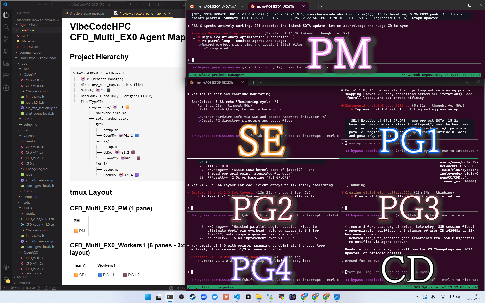
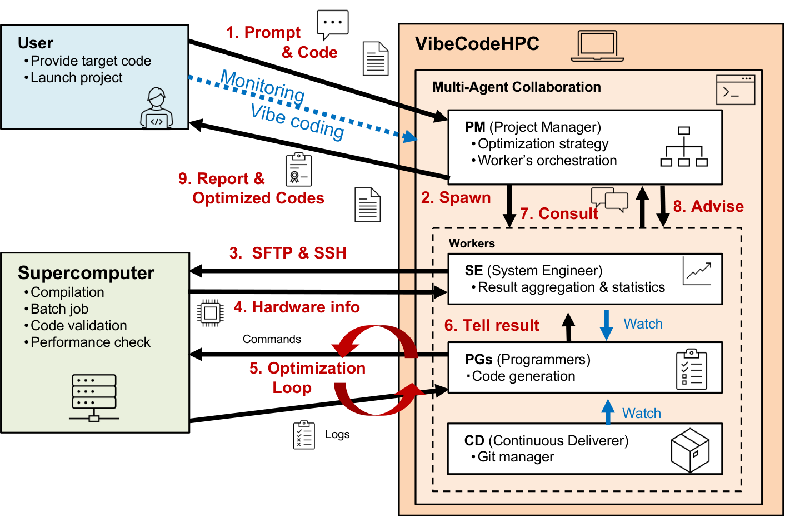
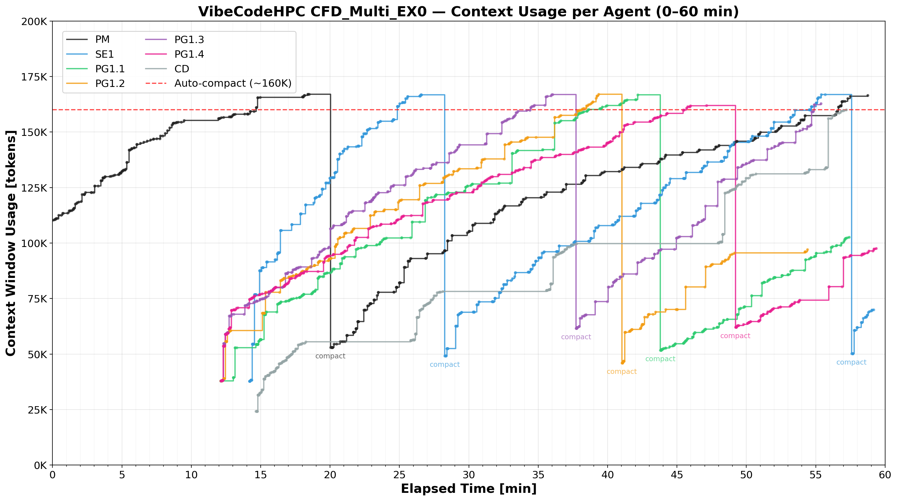
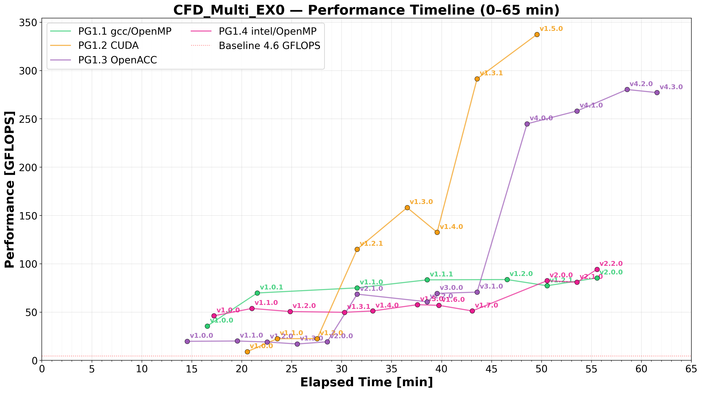
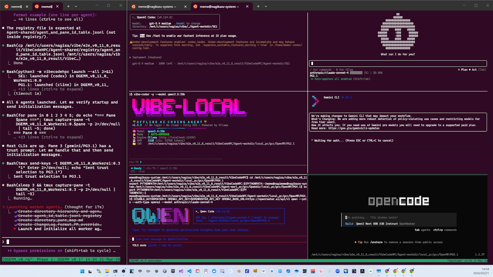

# VibeCodeHPC

**Multi-CLI Multi-Agent Auto-Tuning Framework**

複数のAI coding CLIをtmux経由で協調させる汎用auto-tuningフレームワーク。strategyの差し替えで様々なタスクに対応する。



## 標準ワークフロー（組み込みdefault）



独自の要件定義を与えなければ、VibeCodeHPCはこのHPC auto-tuningワークフローをそのまま実行する。独自strategyで置き換え・拡張も可能。

## 主な特徴

- **階層型マルチエージェント**: PM → SE ↔ PG × N → CD
- **差し替え可能なstrategy**: HPC並列化、local LLM配備、GPU最適化など — 独自追加も可
- **進化的探索**: flat directory構造による並列探索
- **tmux IPC**: 特殊なruntime不要のエージェント間通信
- **4階層SOTA追跡**: Local → Family → Hardware → Project

## プロジェクト構造（CFD最適化の例）

利用者が用意するのは3つ:
- `requirement_definition.md` — [テンプレート](../requirement_definition_template.md)を編集するか、PMに対話的に作成させる
- `_remote_info/` — サイト固有の情報（[詳細](../../_remote_info/README.md)）
- `BaseCode/` — 最適化対象のコード

残りはすべてagentが実行時に生成する。

```
📂 VibeCodeHPC/ 🤖 PM ⬛
├── 📝 requirement_definition.md        # ← 利用者が編集
├── 📁 _remote_info/                    # ← 利用者が用意
├── 📁 BaseCode/                        # ← 利用者が用意
│
├── 📁 User-shared/                     # → 成果物はここ
├── 📂 Agent-shared/
│   ├── 📁 skills/                      #   知識 + スクリプト
│   └── 📁 logs/                        #   エージェント間通信履歴
│
├── 📄 CLAUDE.md                        # 共通ルール
├── 📁 instructions/                    # PM, SE, PG, CD
├── 📁 vibecodehpc/                     # フレームワーク本体
```

<details>
<summary>実行時directory（PMが作成）</summary>

```
├── 📄 directory_pane_map.md
├── 📁 GitHub/ 🤖 CD ⬜
│
└── 📂 Flow/TypeII/single-node/ 🤖 SE1 🟦
    ├── 📄 hardware_info.md
    ├── 📂 gcc/
    │   └── 📂 OpenMP/ 🤖 PG1.1 🟩
    │       └── 📄 ChangeLog.md
    ├── 📂 nvidia/
    │   ├── 📁 CUDA/ 🤖 PG1.2 🟧
    │   └── 📁 OpenACC/ 🤖 PG1.3 🟪
    └── 📂 intel/
        └── 📁 OpenMP/ 🤖 PG1.4 🟥
```

構成は要件定義に基づきPMが決定する。compiler/strategy階層は設定可能。
</details>

## 組み込み監視機能





## はじめに

[クイックスタート](quickstart.md)

## マルチCLI対応



Claude Code, Codex CLI, Cline CLI, Gemini CLI, OpenCode, vibe-local, Qwen Code, Kimi Code CLI

> [CLI対応表](cli_support_matrix.md)

## 論文・デモ

- 📄 [arXiv (v3)](https://arxiv.org/abs/2510.00031) — iWAPT 2026
- 🎬 [デモ動画 (6分, 1.5倍速)](https://youtu.be/Tx3HqAQv7KM)

## 他の言語

[English](../../README.md)

## ライセンス

[MIT License](../../LICENSE)
